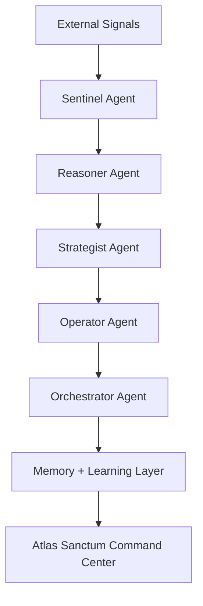

# ⚔️ Atlas Sanctum
### Autonomous Enterprise Command AI

> Transforming fragmented enterprise data into coordinated autonomous action through collaborative AI agents.

---

## 🌍 Vision

Atlas Sanctum is an autonomous enterprise intelligence platform designed to move AI beyond copilots into real decision-making systems.

Instead of simply assisting managers with recommendations, Atlas Sanctum:
- senses operational signals,
- reasons through complex scenarios,
- makes strategic decisions,
- and executes actions autonomously.

The platform combines:
- 🧠 Intelligent Reasoning
- 🔄 Agentic Workflows
- 🧩 Multimodal Intelligence
- 🤝 Collaborative Multi-Agent Systems
- 🌍 Enterprise Utility

---

# 🧠 Core Architecture

Atlas Sanctum is powered by a collaborative multi-agent system.



---

# ⚙️ Agent System

## 🛰 Sentinel Agent
Monitors and ingests:
- enterprise data,
- news feeds,
- operational metrics,
- documents,
- multimodal inputs.

### Responsibilities
- Signal detection
- Risk identification
- Event extraction
- Anomaly detection

---

## 🧠 Reasoner Agent
Performs:
- advanced reasoning,
- scenario simulations,
- adaptive planning,
- causal analysis.

### Responsibilities
- Strategic analysis
- Contradiction detection
- Forecasting
- Autonomous replanning

---

## 🎯 Strategist Agent
Transforms analysis into enterprise decisions.

### Responsibilities
- Prioritize actions
- Balance cost/risk/reward
- Generate execution plans
- Recommend enterprise strategies

---

## ⚙️ Operator Agent
Executes autonomous workflows using APIs and enterprise systems.

### Responsibilities
- Trigger automations
- Send alerts
- Execute workflows
- Update systems

---

## 🔄 Orchestrator Agent
Coordinates all agents and supervises system-wide execution.

### Responsibilities
- Task routing
- Workflow orchestration
- Conflict resolution
- Execution monitoring

---

# 🧩 Multimodal Intelligence

Atlas Sanctum can process:
- 📄 Documents
- 📊 Structured data
- 🖼 Images
- 🎥 Video
- 🎙 Audio
- 🌍 Real-time signals

---

# 🖥 Command Center UI

The Atlas Sanctum dashboard provides:
- 🌍 Global Intelligence Feed
- 🧠 Live Agent Reasoning
- ⚙ Autonomous Execution Logs
- 📈 Enterprise Metrics
- 🌐 Operational Intelligence Maps

---

# 🚀 Example Use Cases

## Supply Chain Intelligence
- Detect disruptions
- Simulate impact
- Recommend mitigation
- Execute supplier workflows

## Crisis Response Coordination
- Monitor emerging risks
- Coordinate enterprise response
- Automate escalation systems

## Enterprise Operations
- Optimize workflows
- Reduce operational delays
- Improve strategic visibility

## Financial Intelligence
- Analyze volatility
- Forecast operational risk
- Support strategic planning

---

# 🛠 Tech Stack

## Frontend
- Next.js
- TailwindCSS
- Framer Motion
- shadcn/ui

## Backend
- FastAPI
- LangGraph / CrewAI
- Redis
- PostgreSQL

## AI Infrastructure
- OpenAI
- Vector Databases
- RAG Pipelines
- Multimodal Processing

---

# 🔐 Security + Governance

Atlas Sanctum includes:
- Explainable AI reasoning
- Audit trails
- Human override controls
- Ethical policy constraints
- Role-based access management

---

# 🌍 Mission

Atlas Sanctum aims to become the autonomous intelligence layer for enterprises, governments, and institutions operating in increasingly complex environments.

We believe the future of AI is not passive assistance —
but coordinated autonomous systems capable of turning intelligence into action.

---

# 📈 Enterprise Impact

Atlas Sanctum helps organizations:
- Reduce operational risk
- Accelerate decision cycles
- Improve strategic coordination
- Automate enterprise workflows
- Increase resilience in complex environments

---

# ⚡ Core Philosophy

```text
SENSE → THINK → DECIDE → ACT → LEARN
```

---

# 🧬 Future Roadmap

- Autonomous enterprise simulations
- Predictive operational intelligence
- AI-to-AI collaboration layers
- Cross-organizational coordination systems
- Ethical autonomous governance frameworks

---

# 🏁 Atlas Sanctum

### Autonomous Intelligence for Enterprise Decision Systems

> “From Signals to Autonomous Action.”
